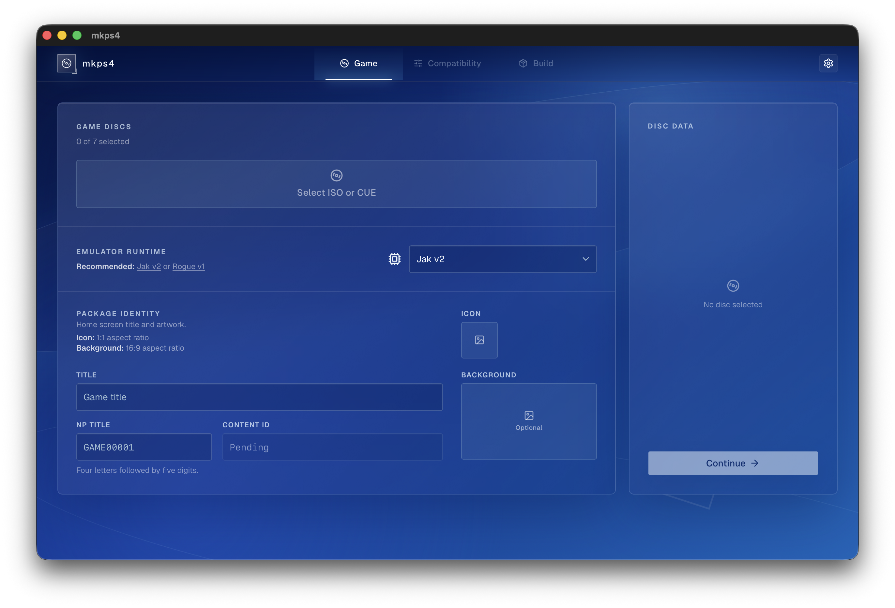

<p align="center">
  
</p>

## Introduction

`mkps4` is a cross-platform application that converts PS2 disc images into PS4
packages. It provides a native desktop app and a command-line interface without
requiring Wine or the Windows-only `orbis-pub-cmd.exe`.



> [!NOTE]
> mkps4 has been tested on the following systems:
>
> - macOS arm64
> - NixOS x86_64
>
> Windows support is implemented and should work in principle, but is currently
> unverified.

It supports one to seven ISO or single-file CUE/BIN images, custom package
identity and artwork, emulator compatibility settings, patch payloads, formatted
memory cards, Vita Remote Play layouts, and Lua files.

## Prerequisites

To create and use a package, you need:

- A PS2 game image that you are legally entitled to use
- A homebrew-enabled PS4 capable of installing custom PKGs


## GUI

Download the appropriate archive or installer from the latest GitHub Release:

- macOS arm64: `mkps4-macos-arm64-gui.zip`
- Linux x86_64: `mkps4-linux-x86_64-gui.AppImage`
- Windows x86_64: `mkps4-windows-x86_64-gui-setup.exe`

The macOS build is ad-hoc signed but not Apple-notarized. After moving
`mkps4.app` to `/Applications`, remove the download quarantine once before
opening:

```sh
xattr -rc /Applications/mkps4.app
```

Make the Linux AppImage executable before launching it:

```sh
chmod +x mkps4-linux-x86_64-gui.AppImage
```

The app guides the complete package workflow:

- Select one to seven ISO or CUE images.
- Choose an installed emulator runtime.
- Set the title, NP title, icon, and optional background artwork.
- Review or override the detected PS2 serial and related IDs.
- Configure rendering, upscaling, display mode, multitap, and disc-change reset.
- Apply graphics, speed, MTVU, VIF1, and CLUT compatibility fixes.
- Add an optional emulator config, formatted memory card, patch payloads, and Lua files.
- Choose a Vita Remote Play layout.
- Choose the output PKG and monitor build and validation progress.

## CLI

Prebuilt CLI archives are attached to each GitHub Release:

- macOS arm64: `mkps4-macos-arm64-cli.zip`
- Linux x86_64: `mkps4-linux-x86_64-cli.tar.gz`
- Windows x86_64: `mkps4-windows-x86_64-cli.zip`

Instructions for building the CLI from source are available under
[Contributing](#contributing).

Install the emulator collection, or replace an existing installation:

```sh
mkps4 setup
mkps4 setup --force
```

Inspect a disc and print its detected identifiers:

```sh
mkps4 inspect game.iso
```

Build a package:

```sh
mkps4 build \
  --template "$HOME/.mkps4/emulators/jak-v2" \
  --title "Game Title" \
  --np-title GAME00001 \
  --icon ./icon.png \
  --background ./background.png \
  --rendering native \
  --upscale none \
  --display-mode full \
  --graphics-fix on \
  --speed-fix off \
  --disable-mtvu off \
  --disable-instant-vif1 off \
  --clut-merge off \
  --multitap disabled \
  --reset-on-disc-change on \
  --remote-play-keymap 0 \
  --output ./Game.pkg \
  game.iso
```

Compatibility options are optional. Omitted values preserve the selected
custom config or donor defaults:

- `--rendering native|2x2`
- `--upscale none|edge-smooth`
- `--display-mode normal|full|4:3|16:9`
- `--graphics-fix on|off`
- `--speed-fix on|off`
- `--disable-mtvu on|off`
- `--disable-instant-vif1 on|off`
- `--clut-merge on|off`
- `--multitap disabled|port1|port2|both`
- `--reset-on-disc-change on|off`

The older `--universal-compatibility` option remains available as a shorthand
that applies both graphics and speed presets.

Detected disc identity can also be overridden. Supplying `--disc-serial`
derives the related IDs unless they are overridden independently:

- `--disc-serial SLES_523.25`
- `--disc-emulator-id SLES-52325`
- `--disc-title-id SLES52325`

Additional conversion inputs:

- `--content-id`: retain an existing package identity instead of deriving one
- `--config`: replacement `config-emu-ps4.txt`
- `--memory-card`: formatted 8 MB `.ps2` or `.vm2` image with ECC
- `--patch`: `.lua` or `.conf` game patch copied into `patches/` with the
  detected emulator ID; one of each type may be supplied
- `--lua`: Lua include copied into `lua_include/`; repeatable
- `--remote-play-keymap`: Vita Remote Play layout number from 0 through 7
- `--background`: optional 16:9 home-screen background
- `--force`: replace an existing output PKG

Use `prepare` with the same conversion options to preserve the generated GP4
project without building a package:

```sh
mkps4 prepare \
  --template /path/to/template \
  --title "Game Title" \
  --np-title GAME00001 \
  --icon ./icon.png \
  --output ./prepared \
  game.iso
```

Environment variables:

- `MKPS4_HOME`: emulator-store directory
- `MKPS4_TEMPLATE`: default emulator template

Run `mkps4 --help` or `mkps4 <command> --help` for the complete argument list.

## Development

### Contributing

Keep reusable package behavior in `mkps4-core` and emulator installation logic
in `mkps4-emulator-store`. Do not commit emulator runtimes, game images,
generated packages, or backend build artifacts.

### Build

On macOS and Linux, the Nix flake provides all prerequisites needed to build
the CLI, GUI, and package backend. Without Nix, install Rust, Cargo, Node.js 20
or newer, pnpm 8, .NET 8, Git, Perl, and the platform-specific
[Tauri 2 prerequisites](https://v2.tauri.app/start/prerequisites/) manually.

First, build the pinned [LibOrbisPkg](https://github.com/maxton/LibOrbisPkg)
backend with its large-package PlayGo fix:

```sh
nix develop "path:$PWD" -c scripts/build-pkgtool.sh
```

The backend is built from upstream commit
`643477263b2644e0803e0f58b8726ea4e3f3b7d4` as a self-contained .NET 8 binary
for the current operating system and architecture. The GUI bundles it; the CLI
discovers it on `PATH`, at `target/pkgtool/PkgTool.Core`, through
`MKPS4_PKG_TOOL`, or with `--pkg-tool`.

Enter the development shell before running the remaining build commands:

```sh
nix develop "path:$PWD"
```

Install GUI dependencies:

```sh
pnpm --dir apps/mkps4-gui install --frozen-lockfile
```

Build the CLI from the repository root:

```sh
cargo build --release -p mkps4
```

The executable is written to `target/release/mkps4`.

Build the native GUI for the current platform:

```sh
pnpm --dir apps/mkps4-gui tauri build
```

Platform bundles are written below `target/release/bundle`.

Run the desktop app against the repository's ignored `emulators/` directory:

```sh
MKPS4_HOME="$PWD" pnpm --dir apps/mkps4-gui tauri dev
```

Before submitting a change, run:

```sh
cargo fmt --all --check
cargo clippy --workspace --all-targets -- -D warnings
cargo test --workspace
pnpm --dir apps/mkps4-gui build
```

### Pipeline

The repository is organized as a Cargo workspace with two front ends:

```text
crates/mkps4-core            disc inspection and package workflow
crates/mkps4-emulator-store  runtime download, metadata, and local storage
apps/mkps4-cli               command-line interface
apps/mkps4-gui               Tauri 2 and React desktop interface
```

The package pipeline:

1. Read the root-level `SYSTEM.CNF` and detect the PS2 serial.
2. Stage and validate the selected PS2 Classics emulator runtime.
3. Convert or hard-link up to seven ISO or CUE/BIN disc images.
4. Apply package identity, artwork, emulator settings, memory card, and patch payloads.
5. Generate a GP4 project and build it with the native package backend.
6. Validate and atomically move the completed PKG.

Supported inputs are ISO9660 images and single-file CUE/BIN images with
`MODE1/2048`, `MODE1/2352`, `MODE2/2336`, or `MODE2/2352` data tracks.
Multi-file CUE sheets are rejected.

When the input and output use the same filesystem, mkps4 hard-links ISO files
into its temporary project. Cross-filesystem inputs are copied instead, which
accounts for the higher disk-space requirement.

Runtime installation data lives under `~/.mkps4` by default. The
`config.json` file stores the installer version and RFC 3339 update time and is
written only after installation succeeds. It acts as the completion marker for
interrupted-install recovery.

## Disclaimer

mkps4 is free software licensed under the GNU General Public License version 3
or later. See [`LICENSE`](LICENSE) for the complete terms. The bundled
LibOrbisPkg PkgTool remains licensed separately under LGPL-3.0; see
[`THIRD_PARTY_NOTICES.md`](THIRD_PARTY_NOTICES.md).

mkps4 is an independent open-source project and is not affiliated with or
endorsed by Sony Interactive Entertainment. PlayStation, PS2, and PS4 are
trademarks of their respective owners.

This repository does not include Sony emulator binaries, game images, or other
copyrighted console content. Only use software and game data that you are
legally permitted to use. Emulator runtimes downloaded from third-party sources
remain subject to their own licensing and distribution terms.

Package validation checks structure, hashes, and signatures, but it cannot
guarantee that a package will install or launch correctly on PS4 hardware.
Runtime compatibility varies by game and donor, and a known-working runtime
does not guarantee compatibility with every PS2 title.

This software is provided **as is**, without warranty of any kind, express or
implied. The authors and contributors are not liable for hardware or software
damage, data loss, account or console issues, or any other damages arising from
its use. You use mkps4 entirely at your own risk.
